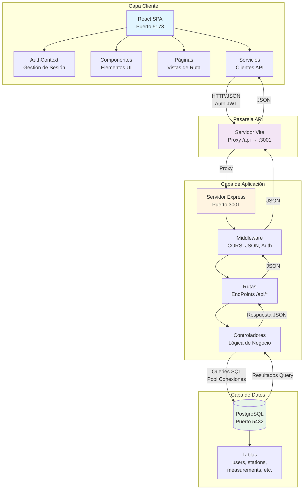
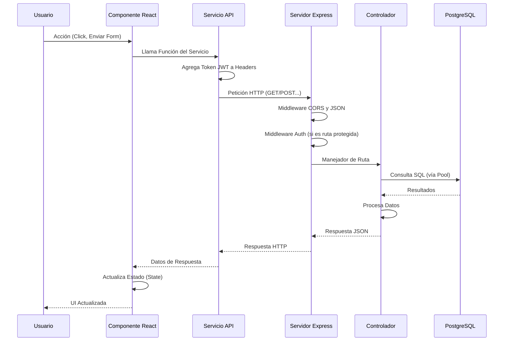
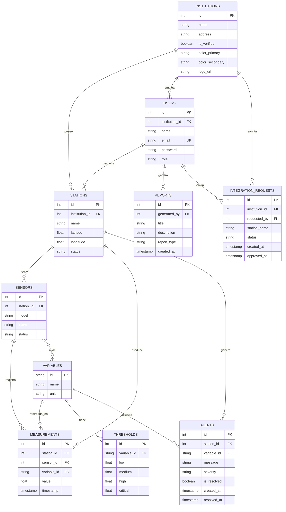

# VriSA - Documentación de Arquitectura del Sistema

## Visión General

**VriSA (Sistema de Vigilancia y Reporte de Información Ambiental)** es una plataforma integral de monitoreo y reporte ambiental diseñada para rastrear, analizar y reportar la calidad del aire y datos ambientales desde múltiples estaciones de monitoreo. El sistema permite a las instituciones registrar estaciones, recolectar mediciones de sensores, generar alertas basadas en violaciones de umbrales y producir reportes analíticos.

### Propósito del Sistema
- **Recolección de Datos Ambientales**: Recopilación en tiempo real de mediciones desde estaciones distribuidas.
- **Gestión Multi-Institución**: Soporte para que múltiples instituciones gestionen sus propias estaciones.
- **Sistema de Alertas**: Generación automática de alertas cuando las mediciones exceden los umbrales definidos.
- **Análisis de Datos**: Análisis histórico y generación de reportes.
- **Dashboard Público**: Interfaz de acceso público para visualizar datos ambientales.
- **Panel Administrativo**: Interfaz completa para la gestión del sistema.

### Alcance
El sistema maneja el ciclo de vida completo del monitoreo ambiental:
- Registro y gestión de estaciones con técnicos responsables.
- Configuración de dispositivos sensores y asociación con variables ambientales.
- Ingesta y almacenamiento de mediciones en tiempo real.
- Generación automática de alertas basadas en umbrales.
- Visualización de tendencias históricas mediante gráficas interactivas.
- Gestión de usuarios e instituciones con apariencia institucional personalizada.
- Carga y gestión de certificados de calibración y mantenimiento.
- Generación y distribución de reportes.
- Flujos de trabajo para solicitudes de integración.

---

## Stack Tecnológico

### Frontend (Cliente)

#### Framework Principal
- **React 19.2.0**: Biblioteca moderna para construir interfaces de usuario basadas en componentes.
- **React Router DOM 7.9.6**: Enrutamiento y navegación del lado del cliente.
- **React Hooks**: Uso de `useState`, `useEffect`, `useContext`, `useMemo` para gestión de estado.

#### Herramientas de Construcción y Desarrollo
- **Vite 7.2.4**: Herramienta de compilación rápida y servidor de desarrollo.
- **@vitejs/plugin-react**: Plugin de React para Vite.
- **ESLint 9.39.1**: Linting de código y aseguramiento de calidad.
- **ES Modules**: Soporte nativo de módulos ES6.

#### Cliente HTTP y Estado
- **Axios 1.13.2**: Cliente HTTP para comunicación con la API.
- **React Context API**: Gestión de estado global (autenticación, sesión de usuario).
- **localStorage**: Persistencia de sesión en el cliente.

#### Visualización de Datos
- **Recharts 2.15.4**: Librería para gráficas y visualización de datos.
- **date-fns 4.1.0**: Utilidades para manipulación de fechas.

#### Estilos
- **CSS3**: CSS personalizado con Variables CSS para temas.
- **Diseño Responsive Mobile-First**: Breakpoints en 480px, 768px, 1024px.
- **CSS Grid y Flexbox**: Sistemas de maquetación modernos.
- **Animaciones CSS**: Transiciones y animaciones keyframe.

### Backend (Servidor)

#### Runtime y Framework
- **Node.js**: Entorno de ejecución de JavaScript.
- **Express.js 5.1.0**: Framework de aplicación web.
- **ES Modules**: Soporte nativo de módulos ES6 (`"type": "module"`).

#### Autenticación y Seguridad
- **jsonwebtoken 9.0.2**: Generación y verificación de tokens JWT.
- **bcryptjs 3.0.3**: Hashing y encriptación de contraseñas.
- **CORS 2.8.5**: Middleware para intercambio de recursos de origen cruzado.

#### Base de Datos
- **pg 8.16.3**: Librería cliente de PostgreSQL (node-postgres).
- **Connection Pooling**: Gestión eficiente de conexiones a la base de datos.

#### Configuración
- **dotenv 17.2.3**: Gestión de variables de entorno.

#### Manejo de Archivos
- **multer 1.4.5-lts.1**: Middleware para manejo de carga de archivos (multipart/form-data).

#### Herramientas de Desarrollo
- **nodemon 3.0.3**: Servidor de desarrollo con reinicio automático.

### Base de Datos

#### Sistema de Base de Datos
- **PostgreSQL 16**: Sistema de gestión de bases de datos relacional.
- **Imagen Docker**: `postgres:16` para despliegue en contenedores.

#### Características Utilizadas
- **Claves Primarias SERIAL**: IDs enteros auto-incrementables.
- **Restricciones de Clave Foránea (FK)**: Integridad referencial.
- **Restricciones CHECK**: Validación de datos a nivel de base de datos.
- **Timestamps**: Gestión automática de marcas de tiempo (`CURRENT_TIMESTAMP`).
- **Eliminación en Cascada (CASCADE)**: Limpieza automática de registros relacionados.

#### Gestión
- **pgAdmin 4**: Herramienta de administración web para PostgreSQL.
- **Contenedor Docker**: `dpage/pgadmin4`.

### DevOps/Herramientas

- **Docker**: Plataforma de contenedorización.
- **Docker Compose 3.9**: Orquestación multi-contenedor.
- **Git**: Control de versiones.
- **JSDoc**: Documentación de código.
- **Scripts**: PowerShell (`setup_project.ps1`) y JS (`seed_database.js`) para inicialización.

---

## Arquitectura del Sistema

### Patrón Arquitectónico

**Arquitectura Cliente-Servidor con API RESTful**

El sistema sigue una **arquitectura de tres capas**:

1. **Capa de Presentación (Frontend)**: SPA (Single Page Application) basada en React.
2. **Capa de Aplicación (Backend)**: Servidor API REST Express.js.
3. **Capa de Datos (Base de Datos)**: Base de datos relacional PostgreSQL.

### Patrón de Comunicación

**API RESTful sobre HTTP/HTTPS**

- **Protocolo**: HTTP/1.1
- **Formato de Datos**: JSON.
- **Autenticación**: JWT (JSON Web Tokens) vía Bearer token en cabecera Authorization.
- **Ruta Base API**: `/api/*`
- **Proxy de Desarrollo**: El servidor Vite redirige peticiones `/api` al backend (puerto 3001).

### Diagrama de Arquitectura



### Data Flow Diagram



---

ProyectoFinalDBM-main/
│
├── client/                      # Aplicación Frontend React
│   ├── src/
│   │   ├── components/          # Componentes UI reutilizables
│   │   │   ├── ChartManager.jsx      # Gestor de múltiples gráficas
│   │   │   ├── MeasurementChart.jsx  # Gráfica de tendencias históricas
│   │   │   ├── DataTable.jsx         # Tabla de datos ordenable
│   │   │   └── Modal.jsx             # Ventanas modales
│   │   │
│   │   ├── hooks/              # Custom React Hooks
│   │   │   └── useBranding.js  # Hook para branding institucional
│   │   │
│   │   ├── context/             # Proveedores de Contexto React
│   │   │   ├── AuthContext.jsx  # Gestión estado autenticación
│   │   │
│   │   ├── pages/               # Vistas/Páginas (Rutas)
│   │   │   ├── admin/           # Páginas del panel admin
│   │   │   ├── Dashboard.jsx    # Dashboard público
│   │   │   └── Login.jsx        # Página de acceso
│   │   │
│   │   ├── services/            # Capa de servicios API
│   │   │   ├── api.js           # Instancia Axios con interceptores
│   │   │   ├── stationService.js
│   │   │   └── userService.js
│   │   │
│   │   ├── App.jsx              # Componente principal (Routing)
│   │   ├── App.css              # Estilos globales
│   │   └── main.jsx             # Punto de entrada
│   │
│   └── package.json             # Dependencias Frontend
│
├── server/                      # Aplicación Backend Express
│   ├── config/
│   │   └── db.js                # Pool de conexión PostgreSQL
│   │
│   ├── controllers/             # Lógica de negocio
│   │   ├── authController.js
│   │   ├── stationController.js
│   │   ├── measurementController.js
│   │   ├── certificateController.js
│   │   ├── variableController.js
│   │   └── thresholdController.js
│   │
│   ├── config/                  # Configuración
│   │   ├── db.js                # Pool PostgreSQL
│   │   └── multer.js            # Configuración carga archivos
│   │
│   ├── middleware/              # Middleware de Express
│   │   ├── authMiddleware.js    # Auth JWT y Roles (RBAC)
│   │   └── errorHandler.js      # Manejo global de errores
│   │
│   ├── routes/                  # Definición de rutas API
│   │
│   ├── database/                # Scripts SQL
│   │   ├── schema.sql           # Esquema completo de la BD
│   │   ├── seed_database.js     # Script de población de datos
│   │   ├── add_technician_id_to_stations.sql
│   │   └── add_certificates_table.sql
│   │
│   ├── index.js                 # Punto de entrada del servidor
│   └── package.json             # Dependencias Backend
│
├── docker-compose.yml           # Orquestación de contenedores
└── ARCHITECTURE.md              # Este archivo
```

### Propósitos de Directorios Clave

#### `/client/src/components/`
Componentes de interfaz de usuario (UI) reutilizables que se pueden usar en múltiples páginas. Incluye:
- **ChartManager.jsx**: Gestor de múltiples gráficas de tendencias históricas con capacidad de agregar/eliminar gráficas dinámicamente.
- **MeasurementChart.jsx**: Componente de gráfica de líneas interactiva para visualizar datos históricos de mediciones ambientales.
- **DataTable.jsx**: Tabla de datos ordenable y responsive.
- **Modal.jsx**: Ventanas modales reutilizables.
- **AdminLayout.jsx**: Layout del panel administrativo con sidebar y navegación.

#### `/client/src/pages/`
Componentes a nivel de página que representan diferentes rutas en la aplicación. Se dividen en páginas públicas y páginas de administración.

#### `/client/src/services/`
Capa de servicio que abstrae la comunicación con la API. Cada archivo de servicio corresponde a una entidad del dominio (estaciones, usuarios, etc.) y proporciona funciones tipadas para las llamadas a la API.

#### `/client/src/context/`
Proveedores de React Context para la gestión del estado global. Incluye:
- **AuthContext.jsx**: Gestión de autenticación y sesión de usuario con información de institución.

#### `/client/src/hooks/`
Custom React Hooks para funcionalidades reutilizables:
- **useBranding.js**: Hook para aplicar colores institucionales dinámicamente a la interfaz.

#### `/server/controllers/`
Capa de lógica de negocio. Los controladores manejan las solicitudes HTTP, validan la entrada, interactúan con la base de datos y formatean las respuestas. Controladores principales:
- **measurementController.js**: Incluye detección automática de alertas cuando se exceden umbrales.
- **certificateController.js**: Gestión de carga, almacenamiento y eliminación de certificados de calibración/mantenimiento.
- **stationController.js**: Gestión de estaciones con soporte para búsqueda, filtrado y asociación de técnicos.
- **authController.js**: Autenticación con inclusión de datos de institución en la respuesta.

#### `/server/routes/`
Definiciones de rutas que asignan endpoints HTTP a funciones del controlador. Las rutas definen el contrato de la API y pueden incluir middleware para autenticación o validación.

#### `/server/middleware/`
Funciones de middleware de Express que procesan las solicitudes antes de que lleguen a los manejadores de rutas. Incluye autenticación, manejo de errores y análisis de solicitudes (parsing).

#### `/server/config/`
Módulos de configuración para servicios externos (base de datos, APIs de terceros). Incluye:
- **db.js**: Pool de conexiones PostgreSQL.
- **multer.js**: Configuración de multer para carga de archivos (certificados) con validación de tipos MIME.

#### `/server/database/`
Definiciones de esquemas de base de datos y scripts de migración. Incluye:
- **schema.sql**: Esquema completo de la base de datos con todas las tablas y relaciones.
- **seed_database.js**: Script Node.js para poblar la base de datos con datos de prueba realistas (~1000 mediciones, múltiples estaciones, usuarios, etc.).
- **add_technician_id_to_stations.sql**: Migración para agregar campo de técnico responsable.
- **add_certificates_table.sql**: Migración para tabla de certificados.

---

## Diseño de Base de Datos

### Visión General de Entidad-Relación

La base de datos sigue un **modelo relacional** con las siguientes entidades clave:

1.  **Users (Usuarios)**: Usuarios del sistema con acceso basado en roles.
2.  **Institutions (Instituciones)**: Organizaciones propietarias de las estaciones de monitoreo.
3.  **Stations (Estaciones)**: Ubicaciones físicas de monitoreo.
4.  **Sensors (Sensores)**: Dispositivos instalados en las estaciones.
5.  **Variables**: Parámetros ambientales que se están midiendo.
6.  **Measurements (Mediciones)**: Datos de series temporales provenientes de los sensores.
7.  **Thresholds (Umbrales)**: Umbrales de alerta para las variables.
8.  **Alerts (Alertas)**: Alertas generadas cuando se superan los umbrales.
9.  **Reports (Reportes)**: Informes analíticos generados.
10. **Integration Requests (Solicitudes de Integración)**: Solicitudes para agregar nuevas estaciones.

### Tablas Principales (Core Tables)

#### `users`
- **Propósito**: Cuentas de usuario del sistema con autenticación.
- **Campos Clave**: `id`, `email` (único), `password` (hasheado), `role`, `institution_id`.
- **Roles**: `admin_general`, `admin_institucion`, `operador_estacion`, `investigador`, `ciudadano`.
- **Relaciones**: 
  - `institution_id` → `institutions.id` (opcional, para usuarios específicos de una institución).

#### `institutions`
- **Propósito**: Organizaciones que gestionan las estaciones de monitoreo.
- **Campos Clave**: `id`, `name`, `is_verified`, `color_primary`, `color_secondary`, `logo_url`.
- **Relaciones**: 
  - Uno-a-muchos con `stations`.
  - Uno-a-muchos con `users` (vía `users.institution_id`).

#### `stations`
- **Propósito**: Ubicaciones físicas de las estaciones de monitoreo.
- **Campos Clave**: `id`, `name`, `latitude`, `longitude`, `status`, `institution_id`, `technician_id`.
- **Relaciones**: 
  - `institution_id` → `institutions.id`.
  - `technician_id` → `users.id` (opcional, técnico responsable).
  - Uno-a-muchos con `sensors`.
  - Uno-a-muchos con `measurements`.
  - Uno-a-muchos con `alerts`.
  - Uno-a-muchos con `certificates`.

#### `sensors`
- **Propósito**: Dispositivos sensores instalados en las estaciones.
- **Campos Clave**: `id`, `station_id`, `model`, `brand`, `status`.
- **Relaciones**: 
  - `station_id` → `stations.id` (Eliminación en cascada - CASCADE).
  - Muchos-a-muchos con `variables` (vía `sensor_variables`).
  - Uno-a-muchos con `measurements`.

#### `variables`
- **Propósito**: Parámetros ambientales (ej. PM2.5, O3, temperatura).
- **Campos Clave**: `id` (VARCHAR, ej. "PM25"), `name`, `unit`.
- **Relaciones**: 
  - Muchos-a-muchos con `sensors` (vía `sensor_variables`).
  - Uno-a-muchos con `measurements`.
  - Uno-a-muchos con `thresholds`.
  - Uno-a-muchos con `alerts`.

#### `measurements`
- **Propósito**: Datos ambientales en series temporales.
- **Campos Clave**: `id`, `value`, `timestamp`, `sensor_id`, `variable_id`, `station_id`.
- **Relaciones**: 
  - `sensor_id` → `sensors.id` (CASCADE).
  - `variable_id` → `variables.id` (CASCADE).
  - `station_id` → `stations.id` (CASCADE).

#### `thresholds`
- **Propósito**: Definiciones de umbrales de alerta para variables.
- **Campos Clave**: `id`, `variable_id`, `low`, `medium`, `high`, `critical`.
- **Relaciones**: 
  - `variable_id` → `variables.id` (CASCADE).

#### `alerts`
- **Propósito**: Alertas generadas cuando se exceden los umbrales.
- **Campos Clave**: `id`, `station_id`, `variable_id`, `message`, `severity`, `is_resolved`, `created_at`, `resolved_at`.
- **Relaciones**: 
  - `station_id` → `stations.id` (CASCADE).
  - `variable_id` → `variables.id` (CASCADE).

#### `reports`
- **Propósito**: Informes analíticos generados.
- **Campos Clave**: `id`, `generated_by`, `title`, `description`, `report_type`, `created_at`.
- **Relaciones**: 
  - `generated_by` → `users.id` (SET NULL al eliminar).

#### `integration_requests`
- **Propósito**: Solicitudes para integrar nuevas estaciones al sistema.
- **Campos Clave**: `id`, `institution_id`, `station_name`, `requested_by`, `status`, `created_at`, `approved_at`.
- **Relaciones**: 
  - `institution_id` → `institutions.id` (SET NULL al eliminar).
  - `requested_by` → `users.id` (SET NULL al eliminar).

#### `certificates`
- **Propósito**: Certificados de calibración y mantenimiento de estaciones y sensores.
- **Campos Clave**: `id`, `station_id`, `sensor_id` (opcional), `file_url`, `file_name`, `file_size`, `mime_type`, `type` (calibración/mantenimiento), `expiration_date`, `uploaded_by`.
- **Relaciones**: 
  - `station_id` → `stations.id` (CASCADE).
  - `sensor_id` → `sensors.id` (SET NULL al eliminar).
  - `uploaded_by` → `users.id` (SET NULL al eliminar).

### Diagrama de Esquema de Base de Datos



### Key Database Design Decisions

1. **CASCADE Deletes**: Stations, sensors, and measurements use CASCADE deletes to maintain referential integrity and prevent orphaned records.

2. **SET NULL on Delete**: User and institution references use SET NULL to preserve historical data when users/institutions are removed.

3. **Composite Keys**: The `sensor_variables` junction table enables many-to-many relationships between sensors and variables.

4. **Timestamp Management**: Automatic timestamp generation using `CURRENT_TIMESTAMP` for audit trails.

5. **CHECK Constraints**: Role and severity fields use CHECK constraints to enforce valid values at the database level.

6. **VARCHAR Primary Keys**: Variables use VARCHAR primary keys (e.g., "PM25") for human-readable identifiers.

---

### Decisiones Clave de Diseño de Base de Datos

1. **Eliminación en Cascada (CASCADE)**: Las estaciones, sensores y mediciones utilizan eliminaciones en cascada para mantener la integridad referencial y prevenir registros huérfanos.

2. **SET NULL al Eliminar**: Las referencias de usuarios e instituciones utilizan `SET NULL` para preservar los datos históricos cuando se eliminan los usuarios o instituciones originales.

3. **Claves Compuestas**: La tabla de unión `sensor_variables` habilita relaciones de muchos a muchos entre sensores y variables.

4. **Gestión de Timestamps**: Generación automática de marcas de tiempo utilizando `CURRENT_TIMESTAMP` para pistas de auditoría.

5. **Restricciones CHECK**: Los campos de rol y severidad utilizan restricciones `CHECK` para forzar valores válidos a nivel de base de datos.

6. **Claves Primarias VARCHAR**: Las variables utilizan claves primarias tipo VARCHAR (ej. "PM25") para tener identificadores legibles por humanos.

---

## Decisiones Clave de Diseño

### 1. **Autenticación Basada en JWT**

**Decisión**: Uso de JSON Web Tokens (JWT) para autenticación sin estado (stateless).

**Justificación**:
- La autenticación sin estado reduce los requisitos de almacenamiento de sesión en el servidor.
- Los tokens pueden validarse sin consultas a la base de datos.
- Soporta sistemas distribuidos y escalado horizontal.
- Los tokens se almacenan en `localStorage` para persistencia entre recargas de página.

**Implementación**:
- Tokens firmados con la variable de entorno `JWT_SECRET`.
- Expiración del token configurable vía `JWT_EXPIRES` (predeterminado: 7 días).
- El token incluye el `id` y `role` del usuario para autorización.
- Inyección automática del token mediante interceptor de solicitudes de Axios.

### 2. **Control de Acceso Basado en Roles (RBAC)**

**Decisión**: Implementar control de acceso basado en roles a nivel de middleware.

**Justificación**:
- Sistema de permisos flexible que soporta múltiples tipos de usuarios.
- La aplicación a nivel de middleware asegura una seguridad consistente.
- Roles definidos: `admin_general`, `admin_institucion`, `operador_estacion`, `investigador`, `ciudadano`.

**Implementación**:
- Función middleware `requireAuth(roles)`.
- Parámetro opcional de array de roles para protección de rutas.
- Un array vacío permite el acceso a cualquier usuario autenticado.
- La verificación de rol se realiza después de validar el token.

### 3. **Pooling de Conexiones**

**Decisión**: Uso de agrupación (pooling) de conexiones de PostgreSQL vía `pg.Pool`.

**Justificación**:
- La reutilización eficiente de conexiones reduce la sobrecarga (overhead).
- Previene el agotamiento de conexiones bajo carga.
- Gestión automática del ciclo de vida de la conexión.
- Instancia única del pool compartida en toda la aplicación.

**Implementación**:
- Pool creado en `config/db.js`.
- Exportado como singleton para uso en toda la aplicación.
- Conexión probada al cargar el módulo.
- Configuración basada en entorno con valores predeterminados sensatos.

### 4. **Patrón de Capa de Servicios**

**Decisión**: Abstraer las llamadas a la API detrás de funciones de servicio.

**Justificación**:
- Separación de responsabilidades: los componentes no necesitan conocer los detalles de la API.
- Configuración centralizada de la API y manejo de errores.
- Más fácil de simular (mockear) para pruebas.
- Uso consistente de la API a través de los componentes.

**Implementación**:
- Archivos de servicio en `/client/src/services/`.
- Cada servicio corresponde a una entidad del dominio.
- Las funciones devuelven promesas de Axios.
- Instancia de Axios configurada con URL base e interceptores.

### 5. **Context API para Estado Global**

**Decisión**: Uso de React Context API para el estado de autenticación.

**Justificación**:
- Evita el "prop drilling" (paso excesivo de propiedades) a través del árbol de componentes.
- Gestión de estado simple para autenticación.
- Característica nativa de React, sin dependencias externas.
- Adecuado para actualizaciones de baja frecuencia.

**Implementación**:
- `AuthContext` provee `user`, `login`, `logout`.
- Sesión restaurada desde `localStorage` al montar.
- El Provider envuelve toda la aplicación en `main.jsx`.

### 6. **Diseño Responsivo Mobile-First**

**Decisión**: Implementar CSS mobile-first con mejora progresiva.

**Justificación**:
- Asegura usabilidad en todos los tamaños de dispositivo.
- Mejor rendimiento en dispositivos móviles.
- Interfaz amigable al tacto (objetos táctiles mínimos de 44px).
- Previene el desplazamiento (scroll) horizontal no deseado.

**Implementación**:
- Breakpoints CSS: 480px, 768px, 1024px.
- Diseños flexibles usando CSS Grid y Flexbox.
- Tipografía y espaciado responsivos.
- Menú toggle móvil para la barra lateral de administración.

### 7. **Diseño de API RESTful**

**Decisión**: Seguir convenciones REST para los endpoints de la API.

**Justificación**:
- Métodos HTTP estándar (GET, POST, PUT, DELETE).
- Estructura de URL predecible.
- Comunicación sin estado (Stateless).
- Fácil de entender y documentar.

**Implementación**:
- URLs basadas en recursos: `/api/stations`, `/api/measurements`.
- Mapeo de métodos HTTP a operaciones:
  - GET: Recuperar recursos.
  - POST: Crear recursos.
  - PUT: Actualizar recursos.
  - DELETE: Eliminar recursos.
- Parámetros de consulta para filtrado: `?search=term&status=active`.

### 8. **Estrategia de Manejo de Errores**

**Decisión**: Middleware de manejo de errores centralizado.

**Justificación**:
- Respuestas de error consistentes en todos los endpoints.
- Reduce la duplicación de código.
- Más fácil de modificar la lógica de manejo de errores.
- Registro (logging) de errores adecuado.

**Implementación**:
- Middleware `errorHandler` registrado al final en la app Express.
- Captura todos los errores de los manejadores de rutas.
- Retorna una respuesta de error JSON estandarizada.
- Registra errores en consola para depuración.

### 9. **Módulos ES (ES Modules)**

**Decisión**: Uso de módulos ES6 en toda la aplicación.

**Justificación**:
- Estándar moderno de JavaScript.
- Mejor "tree-shaking" y optimización.
- Sintaxis de importación/exportación clara.
- Soporte nativo en Node.js y navegadores modernos.

**Implementación**:
- `"type": "module"` en ambos archivos `package.json`.
- Sintaxis `import`/`export` en lugar de `require`/`module.exports`.
- Extensiones de archivo requeridas en importaciones (`.js`).

### 10. **Docker Compose para Desarrollo**

**Decisión**: Uso de Docker Compose para el entorno de desarrollo local.

**Justificación**:
- Entorno de desarrollo consistente para todo el equipo.
- Fácil configuración y gestión de la base de datos.
- Servicios aislados previenen conflictos de puertos.
- Despliegues reproducibles.

**Implementación**:
- Tres servicios: `db`, `pgadmin`, `backend`.
- Persistencia de volumen para datos de base de datos.
- Configuración mediante variables de entorno.
- Dependencias de servicios definidas.

---

## Consideraciones de Seguridad

### Autenticación
- Contraseñas hasheadas usando `bcryptjs` (10 rondas).
- Tokens JWT firmados con clave secreta.
- Tokens almacenados en `localStorage` (considerar cookies `httpOnly` para producción).

### Autorización
- Control de acceso basado en roles forzado a nivel de middleware.
- Las rutas protegidas requieren un token JWT válido.
- Verificaciones de rol previenen accesos no autorizados.

### Validación de Datos
- Restricciones a nivel de base de datos (CHECK, FOREIGN KEY).
- Validación de entrada en controladores.
- Prevención de inyección SQL mediante consultas parametrizadas.

### CORS
- Middleware CORS configurado para peticiones de origen cruzado.
- Debería restringirse a orígenes específicos en producción.

---

## Optimizaciones de Rendimiento

### Frontend
- Memoización de componentes React donde sea apropiado.
- Potencial de carga perezosa (lazy loading) para división de código por rutas.
- Variables CSS para tematización eficiente.
- Tamaño del bundle optimizado vía Vite.

### Backend
- Pooling de conexiones para eficiencia de base de datos.
- Consultas de base de datos indexadas (vía claves primarias/foráneas).
- Filtrado por parámetros de consulta para reducir transferencia de datos.

### Base de Datos
- Índices de clave foránea para rendimiento en uniones (joins).
- Índices de timestamp para consultas de series temporales (recomendado).
- Eliminaciones en cascada para mantener la integridad referencial eficientemente.
---

## Consideraciones de Despliegue

### Variables de Entorno
- Conexión a BD: `DB_HOST`, `DB_USER`, `DB_PASSWORD`, `DB_NAME`, `DB_PORT`.
- Configuración JWT: `JWT_SECRET`, `JWT_EXPIRES`.
- Puerto del Servidor: `PORT` (predeterminado: 3001).

### Recomendaciones para Producción
1. **HTTPS**: Usar HTTPS en producción para transmisión segura de tokens.
2. **Variables de Entorno**: Almacenar secretos en gestión segura de variables.
3. **Backups de BD**: Implementar estrategia regular de respaldo de base de datos.
4. **Registro de Errores**: Integrar servicio de logging de errores (ej. Sentry).
5. **Rate Limiting**: Añadir limitación de tasa (rate limiting) para protección de API.
6. **Validación de Entrada**: Implementar librería de validación exhaustiva (ej. Joi, Zod).
7. **CORS**: Restringir CORS a dominios de producción específicos.
8. **Almacenamiento de Token**: Considerar cookies `httpOnly` en lugar de localStorage.

---

## Mejoras Futuras

### Mejoras Potenciales
1. **Actualizaciones en Tiempo Real**: Integración de WebSockets para datos en vivo.
2. **Caché**: Redis para gestión de sesiones y caché de consultas.
3. **Carga de Archivos**: Almacenamiento S3 para certificados y reportes.
4. **Notificaciones por Email**: Sistema de alertas vía correo electrónico.
5. **Analítica Avanzada**: Base de datos de series temporales dedicada.
6. **Versionado de API**: Versionar endpoints para compatibilidad futura.
7. **GraphQL**: Considerar GraphQL para consultas de datos flexibles.
8. **Microservicios**: Dividir en microservicios para mejor escalabilidad.
9. **Pruebas**: Suite de pruebas completa (unitarias, integración, e2e).
10. **CI/CD**: Pipeline automatizado de pruebas y despliegue.

---

## Conclusión

VriSA está construido utilizando tecnologías web modernas siguiendo las mejores prácticas de seguridad, escalabilidad y mantenibilidad. La arquitectura soporta monitoreo ambiental multi-institución con control de acceso basado en roles, recolección de datos en tiempo real y capacidades completas de reporte. El sistema está diseñado para ser extensible y puede acomodar mejoras futuras a medida que evolucionen los requisitos.
